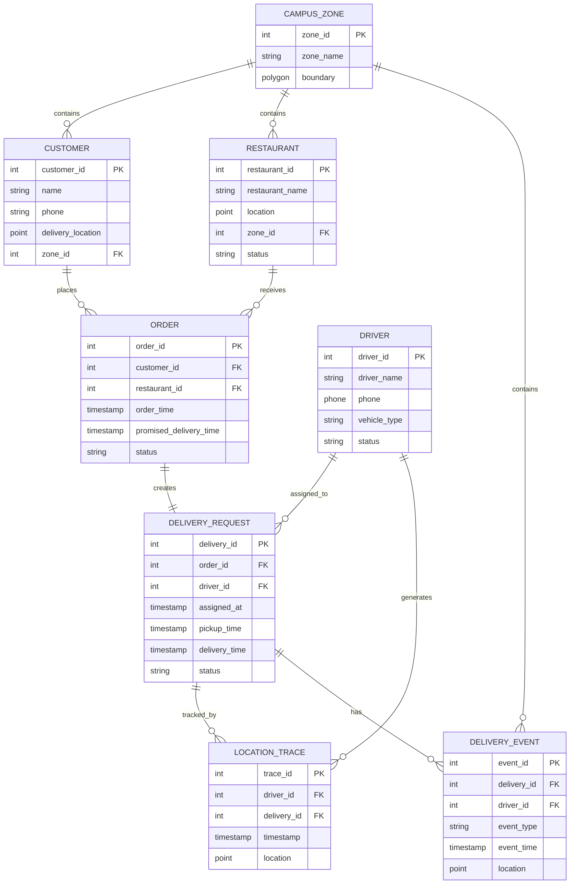

# Spatiotemporal ER Diagram

```mermaid
erDiagram
    CAMPUS_ZONE ||--o{ CUSTOMER : "contains"
    CAMPUS_ZONE ||--o{ RESTAURANT : "contains"
    CAMPUS_ZONE ||--o{ DELIVERY_EVENT : "contains"
    CUSTOMER ||--o{ ORDER : "places"
    RESTAURANT ||--o{ ORDER : "receives"
    ORDER ||--|| DELIVERY_REQUEST : "creates"
    DRIVER ||--o{ DELIVERY_REQUEST : "assigned_to"
    DRIVER ||--o{ LOCATION_TRACE : "generates"
    DELIVERY_REQUEST ||--o{ LOCATION_TRACE : "tracked_by"
    DELIVERY_REQUEST ||--o{ DELIVERY_EVENT : "has"

    CAMPUS_ZONE {
        int zone_id PK
        string zone_name
        polygon boundary
    }

    CUSTOMER {
        int customer_id PK
        string name
        string phone
        point delivery_location
        int zone_id FK
    }

    RESTAURANT {
        int restaurant_id PK
        string restaurant_name
        point location
        int zone_id FK
        string status
    }

    DRIVER {
        int driver_id PK
        string driver_name
        phone phone
        string vehicle_type
        string status
    }

    ORDER {
        int order_id PK
        int customer_id FK
        int restaurant_id FK
        timestamp order_time
        timestamp promised_delivery_time
        string status
    }

    DELIVERY_REQUEST {
        int delivery_id PK
        int order_id FK
        int driver_id FK
        timestamp assigned_at
        timestamp pickup_time
        timestamp delivery_time
        string status
    }

    LOCATION_TRACE {
        int trace_id PK
        int driver_id FK
        int delivery_id FK
        timestamp timestamp
        point location
    }

    DELIVERY_EVENT {
        int event_id PK
        int delivery_id FK
        int driver_id FK
        string event_type
        timestamp event_time
        point location
    }
```